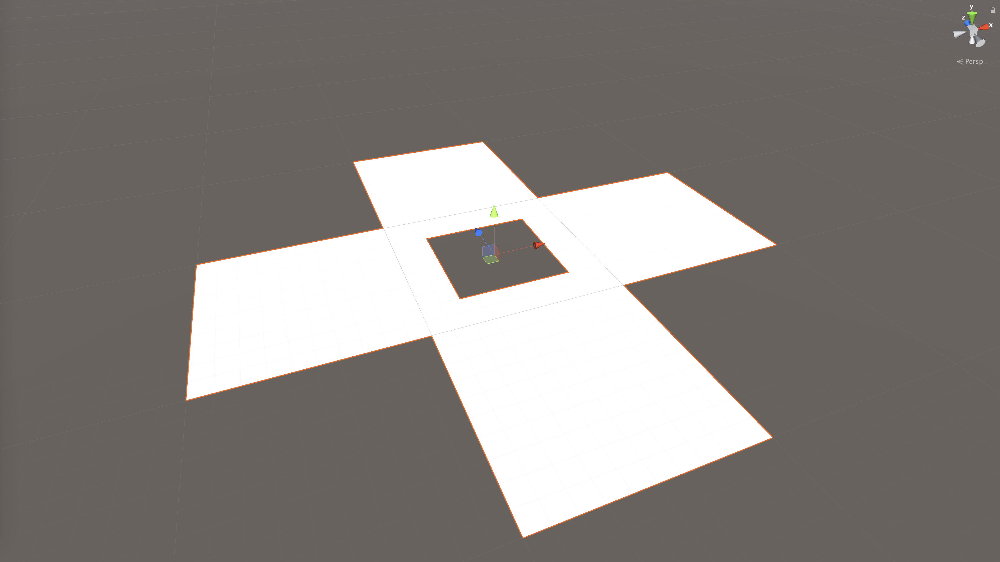
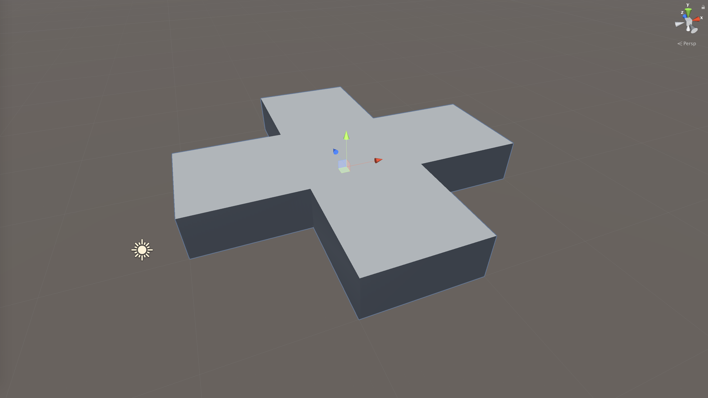
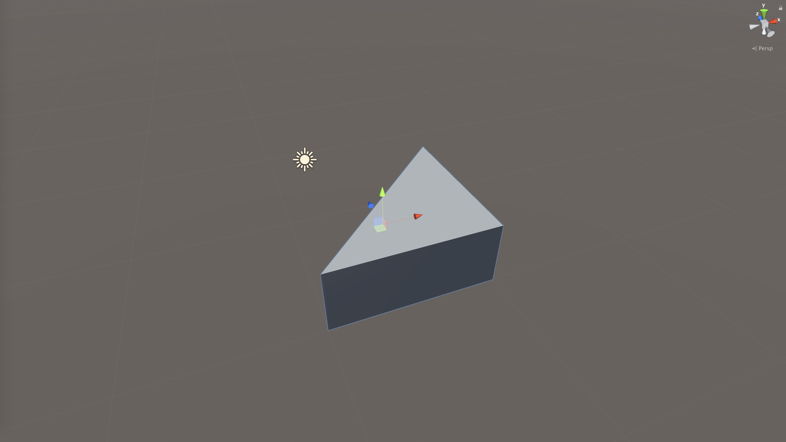
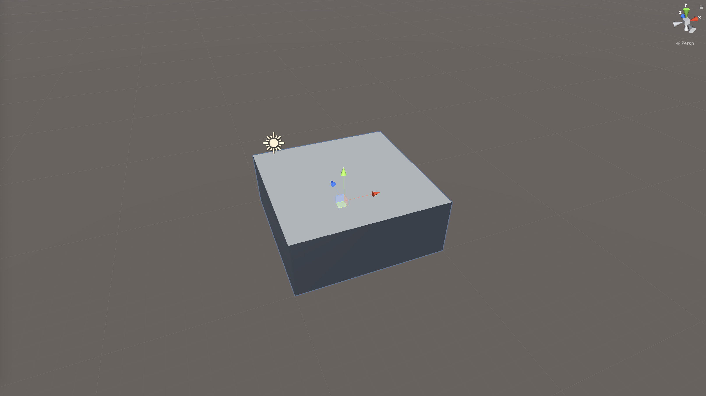
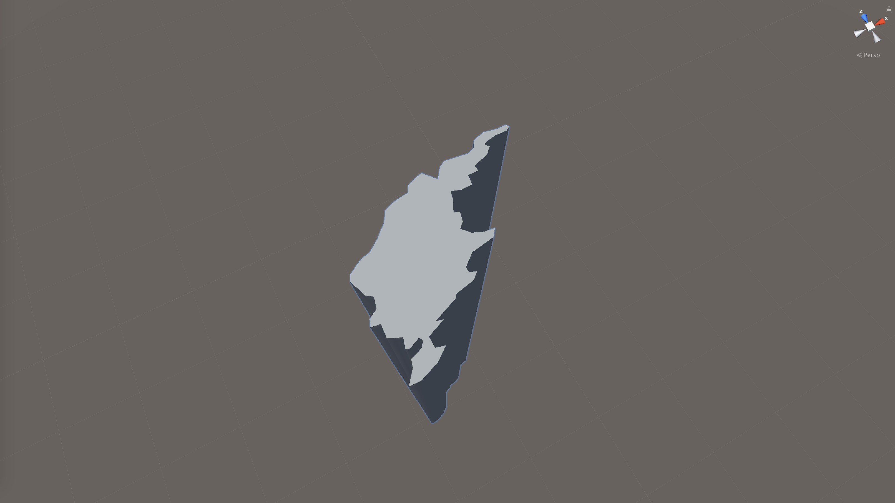
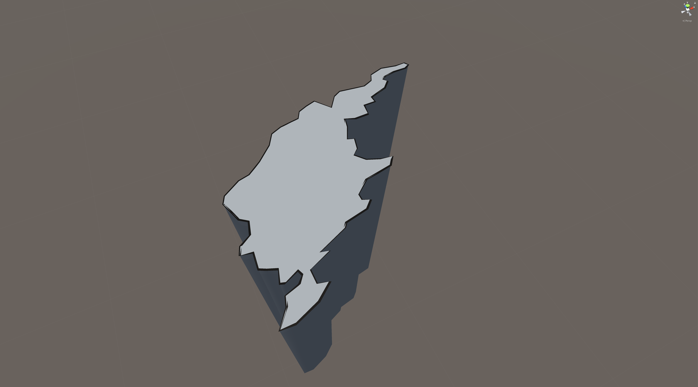
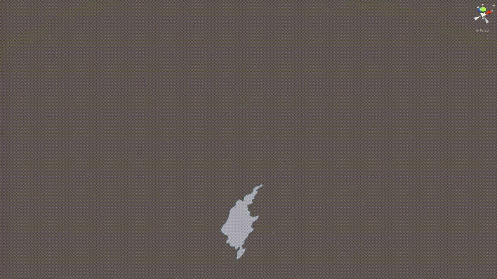
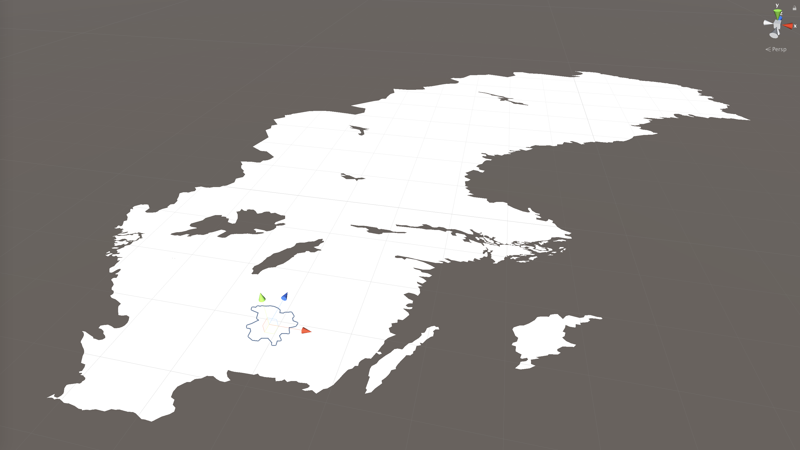
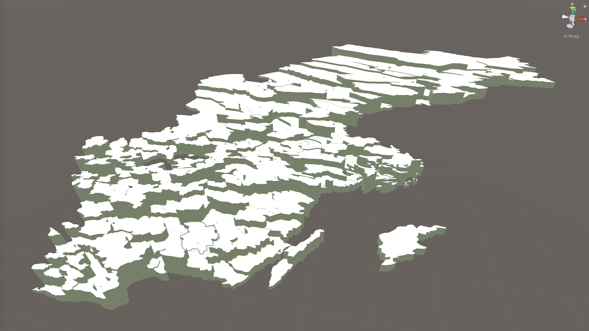

# Unity - PolyExtruder

The purpose of this project is to provide the functionality to create custom meshes (polygons) in Unity based on a collection (array) of vertices directly at runtime. These 2D meshes are created along the x- and z-dimensions in the 3D space. Furthermore, the created custom mesh can be *extruded* (into a 3D prism) along the y-dimension in the 3D space.

#### Background

Some of my research work required me to visualize country borders (geospatial coordinates; received from various open data sources) as individual meshes (2D polygons / 3D prisms) in the 3D space in Unity. Some examples of the usage of this project are provided beneath in the section **Screenshots - SCB Kommun RT90**, demonstrating the visualization of all individual municipalities in the country of Sweden.

## Features

### Triangulation.cs

The `Triangulation.cs` class features a partial implementation of the original [Triangle](http://www.cs.cmu.edu/~quake/triangle.html) and [Triangle.NET](https://archive.codeplex.com/?p=triangle) libraries in order to create render triangles for a custom mesh. The implemented triangulation supports holes in the mesh.

### PolyExtruder.cs

The `PolyExtruder.cs` class is responsible for handling the input data and creating all Unity GameObjects (incl. the actual mesh; 2D polygon / 3D prism) using the features provided through `Triangulation.cs` class in the process. Created 3D prisms (extruded 2D polygons) consist of three GameObjects, namely 1) the bottom mesh (y = 0), 2) the top mesh (y = dynamically assigned; greater than 0), and 3) the surrounding mesh connecting 1 and 2 on their outline accordingly.

Furthermore, the `PolyExtruder.cs` class provides some *quality-of-life* features, such as:

- select whether the mesh should be 2D (polygon) or 3D (extruded, prism)
- calculation of the mesh's (2D polygon's) area
- calculation of the mesh's (2D polygon's) centroid
- set extrusion length ("height")
- select whether or not to visually display the polygon's outline

The main idea is to visualize the 2D input data along the x- and z-dimensions, while the (potential) extrusion is always conducted along the y-dimension. 

### PolyExtruderLight.cs

The `PolyExtruderLight.cs` class is an alternative, lightweight implementation of the original `PolyExtruder.cs` class. Instead of keeping three separate meshes (top, bottom, surround) at runtime, it combines these into one mesh that can be more resource-friendly, particularly when working with many meshes / GameObjects. Please inspect the documentation inside the `PolyExtruderLight.cs` script for additional information and remarks. Please note that the `PolyExtruderLight.cs` class is always setting up the GameObject as an extruded 3D prism.

## Dependencies

This project has been built using the following specifications:

* Apple macOS Sonoma 14.7
* [Unity](https://unity.com) 2022.3.20f1 Personal (Apple Silicon, LTS)

*Note:* Generally, Unity source code should work also within their Windows counterparts. Please check out the above stated dependencies for troubleshooting.

### Resources

Additional resources used to create this project have been accessed as follows:

* (Original) Triangle library implementation *by* Jonathan Richard Shewchuk ([project web page](http://www.cs.cmu.edu/~quake/triangle.html))
* Triangle.NET *by* Christian Woltering ([CodePlex Archive](https://archive.codeplex.com/?p=triangle), [GitHub snapshot](https://github.com/garykac/triangle.net))
* Using Triangle.NET in Unity ([YouTube video; not available anymore as of 2019-06-04](https://www.youtube.com/watch?v=wByVhzokWPo))
* Determine order (clockwise vs. counter-clockwise) of input vertices ([StackOverflow](https://stackoverflow.com/a/1165943))
* Polygons and meshes *by* Paul Bourke ([project web page](http://paulbourke.net/geometry/polygonmesh/))
* Geo-spatial data about the island of Gotland (Sweden) ([Swedish Statistiska centralbyrån (SCB); accessed 2019-02-06](https://www.scb.se/hitta-statistik/regional-statistik-och-kartor/regionala-indelningar/digitala-granser/))

## How to use

#### Import assets to Unity project

In order to add the features provided by this project to your Unity project, I recommend to add the assets by simply importing the pre-compiled `nicoversity-unity_polyextruder.unitypackage`. Alternatively, the repository directory `unity_src` features a directory titled `Assets/nicoversity/polyextrude`, which contains all files that should be manually added to the respective `Assets` directory of an existing Unity project.

#### PolyExtruder.cs class

```cs
// prepare data and options
Vector2[] MyCustomMeshData = new Vector2[]
{
    new Vector2(0.0f, 0.0f),
    new Vector2(10.0f, 0.0f),
    new Vector2(10.0f, 10.0f),
    // ... and more vertices
};
float extrusionHeight = 10.0f;
bool is3D = true;
bool isUsingBottomMeshIn3D = true;
bool isUsingColliders = true;

// create new GameObject (as a child), and further configuration
GameObject polyExtruderGO = new GameObject();
polyExtruderGO.transform.parent = this.transform;
polyExtruderGO.name = "MyCustomMeshName";

// add PolyExtruder script to newly created GameObject,
// keep track of its reference
PolyExtruder polyExtruder = polyExtruderGO.AddComponent<PolyExtruder>();

// configure display of outline (before running the poly extruder)
polyExtruder.isOutlineRendered = true;    // default: false
polyExtruder.outlineWidth = 0.1f;         // default: 0.01f
polyExtruder.outlineColor = Color.blue;   // default: Color.black

// run poly extruder according to input data
polyExtruder.createPrism(polyExtruderGO.name, extrusionHeight, MyCustomMeshData, Color.grey, is3D, isUsingBottomMeshIn3D, isUsingColliders);

// access calculated area and centroid
float area = polyExtruder.polygonArea;
Vector2 centroid = polyExtruder.polygonCentroid;
```

#### Further documentation

All Unity scripts in this project are well documented directly within the source code. Please refer directly to the individual scripts to get a better understanding of the implementation.

### Examples

The imported Unity assets provide three demonstration scenes:

- `TriangleNET_Test.unity`, illustrating and testing the implementation of the `Triangulation.cs` class via `TriangulationTest.cs` script.
- `PolyExtruder_Demo.unity`, illustrating the usage of the `PolyExtruder.cs` class via `PolyExtruderDemo.cs` script. The `PolyExtruderDemo.cs` script allows the user to make selections using the Unity Inspector accordingly to a) select an example data set for the custom mesh creation (Triangle, Square, Cross, SCB Kommun RT90 Gotland), b) indicate whether the custom mesh should be created in 2D (polygon) or 3D (prism), c) the length ("height") of the extrusion, and d) whether the extrusion length should be dynamically scaled at runtime (oscillated movement example). 
- `PolyExtruderLight_Demo.unity`, illustrating the usage of the `PolyExtruderLight.cs` class via `PolyExtruderLightDemo.cs` script, following the same examples as featured in the `PolyExtruderDemo.cs` script.

Please refer to these scenes and scripts to learn more about the examples.

### Screenshots - Example Data

Following, some visual impressions of the included example data, visualized using the `Triangulation.cs`, `PolyExtruder.cs`, and `PolyExtruderLight.cs` classes.

#### Triangulation Test: Cross


#### PolyExtruder: Cross 3D


#### PolyExtruder: Triangle 3D


#### PolyExtruder: Square 3D


#### PolyExtruder: SCB Kommun RT90 Gotland 3D


#### PolyExtruder: SCB Kommun RT90 Gotland 3D with outline


#### PolyExtruder: SCB Kommun RT90 Gotland 3D (movement enabled)


### Screenshots - SCB Kommun RT90

Following, some visual impressions of the earlier stated use case of visualizing all municipalities in the country of Sweden (see *Background*) using the `PolyExtruder.cs` class. The data has been received from the [Swedish Statistiska centralbyrån (SCB)](https://www.scb.se/hitta-statistik/regional-statistik-och-kartor/regionala-indelningar/digitala-granser/) (accessed: 2019-02-06; **Note:** The data is *not* included as part of this project).

#### PolyExtruder: SCB Kommun RT90 2D


#### PolyExtruder: SCB Kommun RT90 3D

A random extrusion length ("height") for each municipality has been applied to emphasize the 3D scenario.



## Known issues

#### Triangulation.cs

1. The function `public static bool triangulate(...)` always returns `true`. In the future, an error list could be implemented to capture errors that occur during the triangulation process.

#### PolyExtruder.cs

1. No holes-support for extrusion (3D prism) is implemented. Although the `Triangulation.cs` script supports holes in the 2D polygon mesh, the support for holes as part of the `PolyExtruder.cs` class *has not* been implemented in this version.

#### PolyExtruderLight.cs

1. No holes-support for extrusion (3D prism) is implemented. Although the `Triangulation.cs` script supports holes in the 2D polygon mesh, the support for holes as part of the `PolyExtruderLight.cs` class *has not* been implemented in this version.
2. Compared to the `PolyExtruder.cs` class, the `Outline Renderer` feature is currently not implemented.
3. Compared to the `PolyExtruder.cs` class, the `MeshCollider` component is currently not implemented.

## Changelog

### 2024-11-25

* Added an alternative, more lighweight implementation of the `PolyExtruder` class, titled `PolyExtruderLight`. `PolyExtruderLight` generates one combined mesh (3D prism only) instead of keeping three separate top, bottom, and surround meshes.

### 2023-01-16

* Minor bug fix: The `updateColor()` function in the `PolyExtruder.cs` class considers now appropriately the coloring of the bottom mesh component depending on whether or not it exists in the 3D prism condition.

### 2023-01-15

* Minor bug fix: Appropriate type casting (`double`) of `Vector2` values in `calculateAreaAndCentroid()` function.
* Modified the default material to utilize Unity's `Standard` shader instead of the legacy `Diffuse` shader.

### 2023-01-13

* Modified `calculateAreaAndCentroid()` function to internally utilize `double` (instead of `float`) type for area and centroid calculations.
* Added feature to conveniently indicate whether or not the bottom mesh component should be attached (only in Prism 3D, i.e., `is3D = true`).
* Added feature to conveniently indicate whether or not `MeshCollider` components should be attached.

### 2023-01-06

* Modified the mesh creation algorithm to use for each vertex the difference between original input vertex and calculated polygon centroid (instead of simply using the original input vertices). This way, the anchor of the generated mesh is correctly located at the coordinate system's origin (0,0), in turn enabling appropriate mesh manipulation at runtime (e.g., via `Scale` property in the `GameObject's Transform`).
* Unity version upgrade to support 2021.3.16f1 (from prior version 2019.2.17f1; no changes in code required).

### 2021-02-17

* Added feature to allow display of the polygon's outline.
* Upgrade to support Unity version 2019.2.17f1 Personal (from prior version 2019.1.5f1; no changes in the code required).

## License
MIT License, see [LICENSE.md](LICENSE.md)
